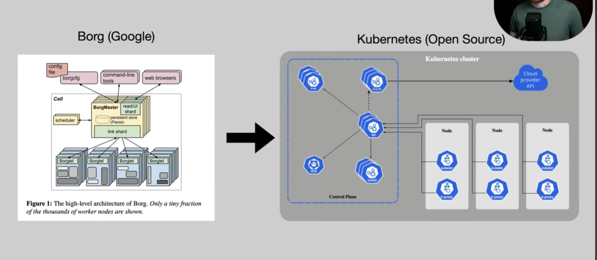
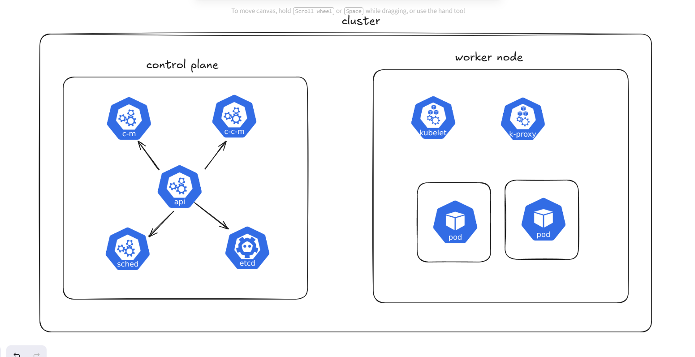
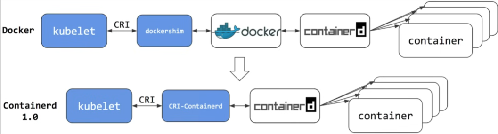

# History and Motivation

## 2000s "Traditional Deployment Era"

* On premises (self-managed or colocation)
* Teams of sysadmins handle provisioning and managing fleets of servers
* Bare metal 🤘
* Monoliths are the only practical architecture
* Home grown monitoring tooling

## 2010s "Virtualized Deployment Era"

* Clouds enable VMs to be created/destroyed in minutes
* Configuration management tooling (e.g. puppet and chef)
* Manual bin-packing of apps onto VMs
* Improved tooling made managing larger number of applications practical
* Managing large numbers of cloud resources is a challenge

## 2020s "Container Deployment Era"

* Workload orchestrators enable treating clusters of machines as a single resource
* These often include utilities and standard interfaces to address:
  * Efficient scheduling across instances
  * Health checks
  * Service discovery
  * Configuration management
  * Autoscaling
  * Persistent storage
  * Networking

Borg was Google’s internal system used for years to manage containers at massive scale (running Gmail, YouTube, Search, etc.).

Later, Google created Kubernetes as a simplified, public version of Borg, so everyone could use similar technology.

### ⚡How Borg evolved into Kubernetes

In simple terms:

* Borg was too complex and tightly coupled to Google’s internal infrastructure

* Google engineers learned best practices from Borg (like scheduling, scaling, self-healing)
* They redesigned it into Kubernetes:
  * More modular

  * Works on any cloud or on-prem
  * Uses simpler concepts (Pods, Nodes, Services)

Key transformation:

* Borg → internal, powerful, complex

* Kubernetes → external, flexible, developer-friendly

## Kubernetes Standard Interfaces

Interfaces:

* Container Runtime Interface (CRI)
* Container Network Interface (CNI)
* Container Storage Interface (CSI)

Defining these interfaces allows for a modular system where innovation can happen outside of the main Kubernetes project and be easily "plugged in" or swapped to achieve new functionality.

### Detailed Explanation of Standard Interfaces

In Kubernetes, standard interfaces act as strict boundaries or contracts between the core orchestration platform and third-party infrastructure technologies. By defining how these pieces should communicate, Kubernetes avoids needing to know the specific details of every underlying tool.

**1. CRI (Container Runtime Interface)**
* **Role:** Dictates how Kubernetes interacts with the actual software that runs and executes the containers.
* **Why it matters:** Originally, Kubernetes was tightly coupled with Docker. CRI was introduced so that Kubernetes could seamlessly use any compliant runtime (like `containerd` or `CRI-O`) without requiring changes to the core Kubernetes code.

**2. CNI (Container Network Interface)**
* **Role:** Defines how network plugins assign IP addresses to containers and ensure they can communicate with one another across different nodes.
* **Why it matters:** Different environments (cloud vs on-prem) have vastly different networking constraints. CNI allows administrators to choose the networking solution (e.g., Calico, Flannel, Cilium) that best fits their specific infrastructure.

**3. CSI (Container Storage Interface)**
* **Role:** Specifies how external storage providers connect their volumes (hard drives, cloud storage) to Kubernetes Pods.
* **Why it matters:** Before CSI, storage plugins were "in-tree" (compiled directly into the Kubernetes source code). This meant storage vendors had to wait for Kubernetes releases to update their plugins. CSI moves this "out-of-tree," enabling storage providers (like AWS EBS, Ceph, etc.) to develop and update their drivers independently.

**Key Benefits of this Modular Approach:**
* **Flexibility:** Teams can easily swap out underlying technologies (like switching from one storage provider to another) with minimal friction.
* **Innovation & Extensibility:** Third-party vendors can rapidly build and update new capabilities without needing to modify the core Kubernetes project.
* **Maintainability:** The central Kubernetes codebase remains clean, lightweight, and focused purely on orchestration.

## The CNCF Landscape

The **CNCF (Cloud Native Computing Foundation)** is the open-source software foundation that hosts Kubernetes and many other related projects. It helps drive the adoption of cloud-native paradigms.

Because Kubernetes is highly modular (thanks to CRI, CNI, CSI, etc.), a massive ecosystem of tools has emerged around it. The **CNCF Landscape** is an interactive, visual map that attempts to organize this massive, sometimes overwhelming, ecosystem (often humorously referred to as "the hellscape" because of how crowded it is).

### Key Concepts of the CNCF Landscape

**1. Categorization:**
The landscape groups hundreds of tools and companies into specific functional categories, making it easier to find solutions for your cluster. Common categories include:
*   **Provisioning:** Automation & Configuration, Container Registries.
*   **Runtime:** Cloud-Native Storage (CSI), Container Runtimes (CRI), Cloud-Native Network (CNI).
*   **Orchestration & Management:** Kubernetes, Service Meshes, Coordination & Service Discovery.
*   **App Definition & Development:** Databases, CI/CD, Streaming & Messaging.
*   **Observability & Analysis:** Monitoring, Logging, Tracing.

**2. Project Maturity Levels:**
The CNCF uses a tier system to indicate the maturity, governance, and adoption level of the open-source projects they host. This helps users decide which tools are safe for production:
*   **Sandbox:** Experimental, early-stage projects. Great for testing new ideas but not strictly recommended for mission-critical production use yet.
*   **Incubating:** Projects that have been successfully used in production by a few companies. They have a healthy number of committers and a clear roadmap.
*   **Graduated:** Highly mature, widely adopted, and battle-tested projects. They have a massive community and are considered completely safe for enterprise production (e.g., Kubernetes, Prometheus, Envoy).

**Why the Landscape Matters:**
While initially intimidating to look at, the landscape highlights the vast "plug-and-play" nature of modern infrastructure. You don't have to use or know every tool; instead, you build a custom stack by choosing the best tool in specific categories tailored to your application's needs.