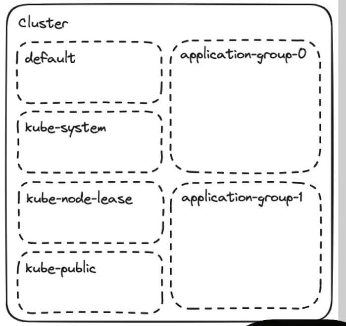

# Built-in kubernetes resources

## How to use this section

- This section is meant to give you awareness of the different types of resources within Kubernetes and their use cases.

- We will revisit many of them in more detail in the context of the demo application later in the course.
- You should leave this section with a high level understanding of the building blocks, and that understanding will solidify as you actually use them in the following sections.

## Namespace

- Provides a mechanism to group resources within a cluster

- There are 4 initial namespaces: default, kube-system, kube-node-lease, kube-public
- 🚨 By default, namespaces DO NOT act as a network/security boundary

```yaml
apiVersion: v1
kind: Namespace
metadata:
  name: non-default
```



### Creating Namespaces

```bash
kubectl create namespace ameer-ns
```

```bash
kubectl get namespace
```

```cmd
NAME              STATUS   AGE
ameer-ns          Active   54s  👈
default           Active   29d
ingress-nginx     Active   21d
kube-node-lease   Active   29d
kube-public       Active   29d
kube-system       Active   29d
```

---

### creating namespace using yml

```yml
apiVersion: v1
kind: Namespace
metadata:
  name: ameer-ns
```

```cmd
kubectl apply -f namespace.yml
```

```cmd
kubectl get namespace
```

```cmd
NAME              STATUS   AGE
ameer-ns          Active   54s  👈
default           Active   29d
ingress-nginx     Active   21d
kube-node-lease   Active   29d
kube-public       Active   29d
kube-system       Active   29d
```

---

### deleting a namespace

```cmd
kubectl delete namespace ameer-ns
```

### deleting namespace using yml

```cmd
kubectl delete -f namespace.yml
```

---

## Pod

- The "smallest deployable unit"
- You will almost never create a pod directly (we are doing so only for educational purposes)

```yaml
apiVersion: v1
kind: Pod
metadata:
  name: nginx-minimal
spec:
  containers:
    - name: nginx
      image: nginx:1.26.0
```

## Pod

```cmd
┌─────────────────────────────────────────────────────┐
│ Pod                                                  │
│                                                      │
│                        ┌───────────────────────┐    │
│                        │   Init Container(s)   │    │
│                        └───────────────────────┘    │
│  ┌──────────────────┐  ┌───────────────────────┐    │
│  │                  │  │                       │    │
│  │    Primary       │  │  Sidecar              │    │
│  │    Container     │  │  Container(s)         │    │
│  │                  │  │                       │    │
│  └──────────────────┘  └───────────────────────┘    │
│                                                      │
└─────────────────────────────────────────────────────┘
```

- A Pod can contain multiple containers

- Containers within a pod share networking and storage
- Init Containers
- Sidecar containers
- There are MANY more configurations available:
  - Listening ports

  - Health probes
  - Resource requests/limits
  - Security Context
  - Environment variables
  - Volumes
  - DNS Policies

---

## Aside: kubectl intro

```bash
kubectl <VERB> <NOUN> -n <NAMESPACE> -o <FORMAT>
```

```bash
alias k=kubectl
kubectx
kubens
```

```bash
k get pods -n 04-pod
k get pods -A # (--all-namespaces)
k get pods -l key=value
```

```bash
k explain <NOUN>.path.to.field
k explain pod.spec.containers.image
```

```bash
k logs <POD_NAME>
k logs deployment/<DEPLOYMENT_NAME>
```

```bash
k exec -it <POD_NAME> -c <CONTAINER_NAME> -- bash
k debug -it <POD_NAME> --image=<DEBUG_IMAGE> -- bash
```

```bash
k port-forward <POD_NAME> <LOCAL_PORT>:<POD_PORT>
k port-forward svc/<DEPLOYMENT_NAME> <LOCAL_PORT>:<POD_PORT>
```

---

### Creating a Pod

```yml
apiVersion: v1
kind: Pod
metadata:
  name: lisa-node
spec:
  containers:
    - name: lisa-node-container
      image: itisameerkhan/lisa-node:v1
```

```cmd
kubectl apply -f pod.yml
```

---

```cmd
kubectl get pods
```

```cmd
NAME        READY   STATUS    RESTARTS   AGE
lisa-node   1/1     Running   0          5s
```

---

### Better version of creating a Pod

```yml
apiVersion: v1
kind: Pod 
metadata: 
  name: lisa-node
  namespace: ameer-ns
spec: 
  containers:
    - name: lisa-node-container
      image: itisameerkhan/lisa-node:v5
      ports:  
        - containerPort: 8080
          protocol: TCP 
      readinessProbe: 
        httpGet: 
          path: / 
          port: 8080
      resources: 
        limits:
          memory: "200Mi"
        requests: 
          memory: "200Mi" 
          cpu: "250m"
      securityContext: 
        allowPrivilegeEscalation: false 
        privileged: false
  securityContext:
    seccompProfile: 
      type: RuntimeDefault
    runAsUser: 1001
    runAsGroup: 1001
    runAsNonRoot: true
```

```json
{
  "success": true,
  "message": "server status ok 😍",
  "version": "v5",
  "hostname": "lisa-node",
  "time": "05 Apr 2026, 12:00:14 pm",
  "platform": "linux",
  "memory": {
    "rss": "73.48 MB",
    "heapTotal": "9.59 MB",
    "heapUsed": "8.09 MB",
    "external": "2.15 MB"
  },
  "system": {
    "userId": 1001,
    "groupId": 1001,
    "isRoot": false,
    "cpuCores": 12,
    "totalMemoryMB": "7571.20 MB",
    "freeMemoryMB": "5664.23 MB"
  },
  "arch": "x64",
  "uptimeSeconds": "205.10",
  "uptimeMinutes": "3.42 min",
  "secret": "no secret found",
  "port": 8080
}
```

> [!NOTE]
> deleting a namespace also deletes a pod inside it


### creating a namespace 

```cmd
kubectl create namespace ameer-ns
```

```cmd
kubectl get pods --namespace=ameer-ns
```

```cmd
kubectl delete namespace ameer-ns
```

---

## ReplicaSet

- Maintains a stable set of replica Pods running at any given time.
- Often used to guarantee the availability of a specified number of identical Pods.
- 🚨 You will rarely create a ReplicaSet directly; instead, you will use a Deployment, which manages ReplicaSets for you.

```cmd
┌─────────────────────────────────────────────────────┐
│ ReplicaSet                                          │
│                                                     │
│   ┌──────────────┐ ┌──────────────┐ ┌──────────────┐│
│   │              │ │              │ │              ││
│   │     Pod      │ │     Pod      │ │     Pod      ││
│   │              │ │              │ │              ││
│   └──────────────┘ └──────────────┘ └──────────────┘│
│                                                     │
└─────────────────────────────────────────────────────┘
```

### creating a replicaset 

```yml
apiVersion: apps/v1
kind: ReplicaSet 
metadata: 
  name: lisa-node-rs
spec: 
  replicas: 3
  selector:
    matchLabels: 
      app: lisa-node 
  template:
    metadata:
      labels:
        app: lisa-node
    spec: 
      containers:
        - name: lisa-node-container
          image: itisameerkhan/lisa-node:v5
          ports:  
            - containerPort: 8080
              protocol: TCP
```

```cmd
kubectl apply -f pod.yml
```

```cmd
kubectl get pods 
```

```cmd
NAME                 READY   STATUS    RESTARTS   AGE
lisa-node-rs-799zs   1/1     Running   0          32s
lisa-node-rs-9xkx2   1/1     Running   0          32s
lisa-node-rs-qqpp7   1/1     Running   0          32s
```

```cmd
kubectl get replicaset
```

```cmd
NAME           DESIRED   CURRENT   READY   AGE
lisa-node-rs   3         3         3       2m6s
```

---

## Deployment

- Provides declarative updates for Pods and ReplicaSets.
- It is the most common way to deploy stateless applications.
- Enables easy rolling updates, rollbacks, and scaling.

```cmd
┌─────────────────────────────────────────────────────────────┐
│ Deployment                                                  │
│                                                             │
│   ┌─────────────────────────────────────────────────────┐   │
│   │ ReplicaSet (Current)                                │   │
│   │                                                     │   │
│   │   ┌──────────────┐ ┌──────────────┐ ┌──────────────┐│   │
│   │   │     Pod      │ │     Pod      │ │     Pod      ││   │
│   │   └──────────────┘ └──────────────┘ └──────────────┘│   │
│   └─────────────────────────────────────────────────────┘   │
│                                                             │
│   ┌─────────────────────────────────────────────────────┐   │
│   │ ReplicaSet (Old / Rolled Back)                      │   │
│   │                                                     │   │
│   └─────────────────────────────────────────────────────┘   │
└─────────────────────────────────────────────────────────────┘
```

### creating a deployment 

```yml
apiVersion: apps/v1
kind: Deployment
metadata:
  name: lisa-node-deployment
spec:
  replicas: 3
  strategy:
    type: RollingUpdate
  selector:
    matchLabels:
      app: lisa-node
  template:
    metadata:
      labels:
        app: lisa-node
    spec:
      containers:
        - name: lisa-node-container
          image: itisameerkhan/lisa-node:v4
          ports:
            - containerPort: 8080
```

---

## Service

- Serves as an internal load balancer across replicas
- Uses pod labels to determine which pods to serve
- Types:
  - **ClusterIP:** Internal to cluster
  - **NodePort:** Listens on each node in cluster
  - **LoadBalancer:** Provisions external load balancer

### ClusterIP

```yml
apiVersion: v1
kind: Service
metadata:
  name: nginx-clusterip
spec:
  type: ClusterIP # Default
  selector:
    app: nginx-pod-label
  ports:
    - protocol: TCP
      port: 80
      targetPort: 80
```

### NodePort

```yml
apiVersion: v1
kind: Service
metadata:
  name: nginx-nodeport
spec:
  type: NodePort
  selector:
    app: nginx-pod-label
  ports:
    - protocol: TCP
      port: 80
      targetPort: 80
      # nodePort: 30XXX
```

### LoadBalancer

```yml
apiVersion: v1
kind: Service
metadata:
  name: nginx-loadbalancer
spec:
  type: LoadBalancer
  selector:
    app: nginx-pod-label
  ports:
    - protocol: TCP
      port: 80
      targetPort: 80
```